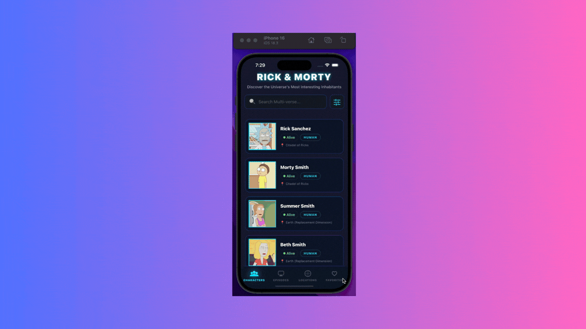

<div align="center">

# 🛸 RickMortyHub

A **React Native** application for exploring the Rick and Morty universe — browse characters, episodes, and locations, and bookmark your favourites with offline persistence.

[](https://reactnative.dev/)
[](https://www.typescriptlang.org/)
[](https://reactnative.dev/)
[](https://jestjs.io/)
[](LICENSE)

</div>

---

## Demo🔥



## 📋 Table of Contents

- [Features](#-features)
- [Architecture Overview](#-architecture-overview)
- [Project Structure](#-project-structure)
- [Libraries Used](#-libraries-used)
- [Prerequisites](#-prerequisites)
- [Project Setup](#-project-setup)
- [Running Tests](#-running-tests)
- [Building a Release APK](#-building-a-release-apk)
- [Known Issues & Limitations](#-known-issues--limitations)

---

## ✨ Features

| Feature                | Description                                                                           |
| ---------------------- | ------------------------------------------------------------------------------------- |
| 🧬 **Characters**      | Browse all Rick & Morty characters with real-time search and filters (Status, Gender) |
| 📺 **Episodes**        | Explore all episodes across every season                                              |
| 🗺️ **Locations**       | Discover all locations from the show                                                  |
| ❤️ **Favourites**      | Save characters as favourites with full offline persistence via SQLite                |
| 📡 **Offline Banner**  | Real-time network status indicator when internet is unavailable                       |
| 🔍 **Search & Filter** | Debounced search and bottom-sheet filter modal for Characters                         |
| 🎨 **Dark Neon UI**    | Custom dark-mode design with neon glow effects and smooth animations                  |

---

## 🏗️ Architecture Overview

The app follows a **feature-based, unidirectional data flow** architecture:

```
┌─────────────────────────────────────────────────────┐
│                      UI Layer                       │
│         (Screens → Components → Hooks)              │
└────────────────────┬────────────────────────────────┘
                     │
       ┌─────────────▼──────────────┐
       │      State Management      │
       │  Redux Toolkit (Favourites │
       │  + Filters) + React Query  │
       │  (API data / pagination)   │
       └─────────────┬──────────────┘
                     │
       ┌─────────────▼──────────────┐
       │       Data Layer           │
       │  Axios (REST API) +        │
       │  OP-SQLite (Favourites DB) │
       └────────────────────────────┘
```

- **API**: [Rick and Morty API](https://rickandmortyapi.com/) — public, free, no auth required.
- **Server State**: `@tanstack/react-query` handles pagination, caching, and background refetching.
- **Client State**: `@reduxjs/toolkit` manages UI state (favourites list, active filters).
- **Persistence**: `@op-engineering/op-sqlite` stores favourite characters in a local SQLite database.
- **Navigation**: `@react-navigation` with a custom Bottom Tab Navigator.

---

## 📁 Project Structure

```
RickMortyHub/
├── __tests__/                      # Root-level integration test
│   └── App.test.tsx
├── src/
│   ├── api/                        # Axios instance & API functions
│   │   └── axiosInstance.ts
│   ├── components/                 # Shared/global components
│   │   └── OfflineBanner.tsx
│   ├── constants/                  # App-wide constants (DB name, API base URL)
│   ├── database/                   # SQLite database layer
│   │   └── db.ts                   # CRUD operations for favourites
│   ├── features/                   # Feature modules (self-contained)
│   │   ├── characters/             # Characters list, detail, search, filter
│   │   ├── episodes/               # Episodes list & cards
│   │   ├── favourites/             # Favourites screen & cards
│   │   └── locations/              # Locations list & cards
│   ├── hooks/                      # Custom reusable hooks
│   │   ├── useDebounce.ts
│   │   └── useNetworkStatus.ts
│   ├── navigation/                 # React Navigation setup
│   │   ├── BottomTabNavigator.tsx
│   │   ├── RootNavigator.tsx
│   │   └── TabIcons.tsx
│   ├── store/                      # Redux Toolkit store
│   │   ├── index.ts
│   │   └── slices/
│   │       ├── favouritesSlice.ts  # Async thunks for SQLite favourites
│   │       └── filtersSlice.ts     # Filter state for character search
│   ├── types/                      # TypeScript type definitions
│   └── __tests__/                  # Unit tests
│       ├── apiService.test.ts
│       ├── favouritesSlice.test.ts
│       └── useDebounce.test.ts
├── App.tsx                         # Root component with all providers
├── index.js                        # App entry point
├── jest.config.js                  # Jest configuration
├── jest.setup.js                   # Jest mock setup for native modules
├── babel.config.js                 # Babel + module alias config
├── metro.config.js                 # Metro bundler config
└── tsconfig.json                   # TypeScript config with path aliases
```

---

## 📦 Libraries Used

### Core

| Library        | Version  | Purpose                         |
| -------------- | -------- | ------------------------------- |
| `react-native` | `0.84.1` | Cross-platform mobile framework |
| `react`        | `19.2.3` | UI library                      |
| `typescript`   | `^5.8.3` | Static typing                   |

### Navigation

| Library                          | Version    | Purpose                             |
| -------------------------------- | ---------- | ----------------------------------- |
| `@react-navigation/native`       | `^7.2.2`   | Navigation core                     |
| `@react-navigation/bottom-tabs`  | `^7.15.9`  | Bottom tab bar                      |
| `@react-navigation/native-stack` | `^7.14.11` | Stack navigation for detail screens |
| `react-native-screens`           | `^4.24.0`  | Native screen containers            |
| `react-native-safe-area-context` | `^5.7.0`   | Safe area insets                    |

### State Management

| Library                 | Version   | Purpose                            |
| ----------------------- | --------- | ---------------------------------- |
| `@reduxjs/toolkit`      | `^2.11.2` | Redux store, slices & async thunks |
| `react-redux`           | `^9.2.0`  | React bindings for Redux           |
| `@tanstack/react-query` | `^5.99.2` | Server state, caching & pagination |

### Networking

| Library                           | Version   | Purpose                                        |
| --------------------------------- | --------- | ---------------------------------------------- |
| `axios`                           | `^1.15.1` | HTTP client with request/response interceptors |
| `@react-native-community/netinfo` | `^12.0.1` | Network connectivity monitoring                |

### Database

| Library                     | Version    | Purpose                                                        |
| --------------------------- | ---------- | -------------------------------------------------------------- |
| `@op-engineering/op-sqlite` | `^15.2.11` | High-performance SQLite (JSI-based) for favourites persistence |

### UI & Animation

| Library                        | Version   | Purpose                                          |
| ------------------------------ | --------- | ------------------------------------------------ |
| `react-native-reanimated`      | `^4.3.0`  | Smooth animations (character cards, transitions) |
| `react-native-gesture-handler` | `^2.31.1` | Gesture support for swipe interactions           |
| `react-native-fast-image`      | `^8.6.3`  | Optimised image loading with caching             |
| `react-native-worklets`        | `^0.8.1`  | JS worklets runtime for Reanimated v4            |

### Testing

| Library                         | Version    | Purpose                       |
| ------------------------------- | ---------- | ----------------------------- |
| `jest`                          | `^29.6.3`  | Test runner                   |
| `react-test-renderer`           | `19.2.3`   | Component rendering for tests |
| `@testing-library/react-native` | `^13.3.3`  | Testing utilities             |
| `@types/jest`                   | `^29.5.13` | TypeScript types for Jest     |

---

## ✅ Prerequisites

Ensure the following are installed and configured on your machine:

| Tool                 | Version                           | Check                        |
| -------------------- | --------------------------------- | ---------------------------- |
| **Node.js**          | ≥ 22.11.0                         | `node --version`             |
| **npm**              | ≥ 10                              | `npm --version`              |
| **Java (JDK)**       | 17                                | `java --version`             |
| **Android Studio**   | Latest                            | Android SDK, Emulator        |
| **Android SDK**      | API 35+                           | via Android Studio           |
| **Xcode**            | 15+ _(macOS, iOS only)_           | Mac App Store                |
| **CocoaPods**        | Latest _(macOS, iOS only)_        | `sudo gem install cocoapods` |
| **React Native CLI** | via `@react-native-community/cli` | Bundled as dev dependency    |

> **Android SDK Environment Variables** — Add these to your `~/.zshrc` or `~/.bashrc`:
>
> ```bash
> export ANDROID_HOME=$HOME/Library/Android/sdk
> export PATH=$PATH:$ANDROID_HOME/emulator
> export PATH=$PATH:$ANDROID_HOME/platform-tools
> ```

---

## 🚀 Project Setup

### 1. Clone the Repository

```bash
git clone https://github.com/Sagarkumar2707/RickMortyHub.git
cd RickMortyHub
```

### 2. Install JavaScript Dependencies

```bash
npm install
```

### 3. Android — Start Metro Bundler

Open a terminal and start the Metro development server:

```bash
npm start
```

### 4. Android — Run on Emulator or Physical Device

Open a **new terminal** in the project root:

```bash
npm run android
```

> Make sure an Android emulator is running, or a physical device is connected via USB with **USB Debugging** enabled.

### 5. iOS — Install CocoaPods (macOS only)

```bash
cd ios && bundle install && bundle exec pod install && cd ..
```

Then run:

```bash
npm run ios
```

---

## 🔧 Path Aliases

The project uses TypeScript path aliases for clean imports. These are configured in both `tsconfig.json` and `babel.config.js`:

| Alias           | Resolves To        |
| --------------- | ------------------ |
| `@features/*`   | `src/features/*`   |
| `@hooks/*`      | `src/hooks/*`      |
| `@store/*`      | `src/store/*`      |
| `@api/*`        | `src/api/*`        |
| `@components/*` | `src/components/*` |
| `@database/*`   | `src/database/*`   |
| `@navigation/*` | `src/navigation/*` |
| `@constants/*`  | `src/constants/*`  |
| `@types/*`      | `src/types/*`      |

---

## 🧪 Running Tests

```bash
npm test
```

**Expected Output:**

```
PASS  src/__tests__/apiService.test.ts
PASS  src/__tests__/favouritesSlice.test.ts
PASS  src/__tests__/useDebounce.test.ts
PASS  __tests__/App.test.tsx

Test Suites: 4 passed, 4 total
Tests:       11 passed, 11 total
```

### Test Coverage Summary

| Test File                 | What It Tests                                                                                                       |
| ------------------------- | ------------------------------------------------------------------------------------------------------------------- |
| `apiService.test.ts`      | `fetchCharacterById` — success & error response handling via Axios mock                                             |
| `favouritesSlice.test.ts` | Redux reducer — initial state, `addFavouriteThunk`, `removeFavouriteThunk`, `clearFavourites`, duplicate prevention |
| `useDebounce.test.ts`     | `useDebounce` hook — debounce timing, value updates, cleanup on unmount                                             |
| `App.test.tsx`            | Root `App` component — renders without crashing with all providers                                                  |

### Native Module Mocking

Since Jest runs in a Node.js environment, native modules are mocked in `jest.setup.js`:

- **`@op-engineering/op-sqlite`** → Mocked with in-memory JS stubs
- **`react-native-reanimated`** & **`react-native-worklets`** → Test utilities applied
- **`react-native-safe-area-context`** → Official jest mock from the package
- **`@react-native-community/netinfo`** → Mocked to return "connected"
- **`react-native-fast-image`** → Rendered as a plain `View`

---

## 📦 Building a Release APK

```bash
cd android
./gradlew assembleRelease
```

The APK will be generated at:

```
android/app/build/outputs/apk/release/app-release.apk
```

---

## ⚠️ Known Issues & Limitations

### 1. Jest Worker Teardown Warning

> After running `npm test`, you may see:
>
> ```
> A worker process has failed to exit gracefully and has been force exited.
> ```
>
> This is a known non-breaking warning caused by open async handles (Axios interceptors, NetInfo listeners) not being fully cleaned up after tests. All **11 tests pass**; this is a teardown cosmetic warning only. Use `--detectOpenHandles` to inspect.

### 3. No Search on Episodes & Locations

> The Characters screen has a full search + filter bottom sheet. The Episodes and Locations screens only support basic name search (Locations) or no search at all (Episodes). Advanced filtering by season code, type, or dimension has not been implemented for these tabs.

### 4. No Authentication / User Accounts

> The application uses the [Rick and Morty public API](https://rickandmortyapi.com/), which requires no authentication. There is no user login system — favourites are stored locally on the device only and are not synced across devices.

### 5. Favourites are Device-Local

> All favourite characters are persisted in a local SQLite database on the device. Uninstalling the app will delete all saved favourites.

### 6. No Dark/Light Mode Toggle

> The app ships exclusively in a dark neon theme. A system-level theme toggle (light mode) has not been implemented.

---

## 🌐 API Reference

This app consumes the free, open-source **Rick and Morty REST API**:

| Endpoint             | Description                                                           |
| -------------------- | --------------------------------------------------------------------- |
| `GET /character`     | Paginated list of characters (supports `?name`, `?status`, `?gender`) |
| `GET /character/:id` | Single character by ID                                                |
| `GET /episode`       | Paginated list of episodes                                            |
| `GET /location`      | Paginated list of locations                                           |

- **Base URL**: `https://rickandmortyapi.com/api`
- **Docs**: https://rickandmortyapi.com/documentation

---

<div align="center">

Made with ❤️ using React Native

</div>
